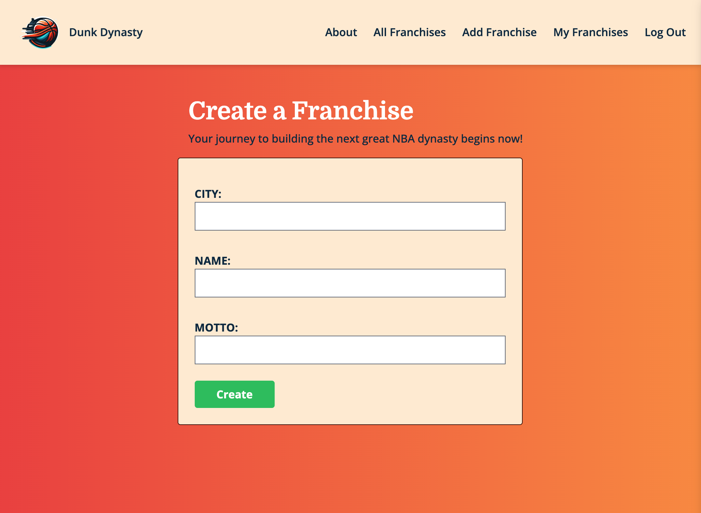

# 🏀 Dunk Dynasty
Welcome to Dunk Dynasty, a full-stack Django application that puts the power in your hands to forge your own fictional NBA franchise. Unleash your creativity as you construct a formidable roster of players, poised to ascend and establish the next legendary NBA dynasty!

⛹️ Tip off here → <a href="https://dunkdynasty-7001c09430f6.herokuapp.com/" target="_blank" rel="noopener noreferrer">Launch Dunk Dynasty</a>

## 👀 Scout the App with Screenshots
### Home Page
Dunk Dynasty welcomes you with an app introduction and user-friendly options to kickstart your basketball journey. As a visitor, you can learn about the application and even view existing franchises.

### Secure Sign Up + Log In
Jump into the game by using Django's built-in authentication - providing you with a seamless account signup and login experience on return visits.

### Create (and Edit) Your Franchise
Craft your basketball legacy with Dunk Dynasty's 'Create a Franchise' page, providing a straightforward form to shape and mold your dream team. Want to relocate your team, or just not happy with the team name? You can edit your franchise details at any time.

### View All Franchises
Effortlessly explore and navigate through all the basketball franchises in Dunk Dynasty, including a dedicated view for easy access to your own team(s).

### Dig into the Franchise Details
Your basketball empire at a glance: Dive into the heart of your team with Dunk Dynasty's 'My Franchise Dashboard', offering comprehensive view, editing, and deletion options. Set a photo that represents your team's city (or motto!), and view your roster at a glance.

### Build Your Roster of Players
Construct your dream team with Dunk Dynasty's 'Roster Builder' – a user-friendly tool for searching and adding NBA players to your lineup, with data provided by balldontlie's exhaustive list of NBA players. Not happy with your lineup? You can cut a player at any time!

## 📃 Credits
### 👾 Technologies Used + Documentation
- Web Framework: <a href="https://docs.djangoproject.com/en/5.0/" target="_blank" rel="noreferrer noopener">Django</a>
- Programming and Markup Languages: <a href="https://docs.python.org/3/" target="_blank" rel="noreferrer noopener">Python</a>, HTML, <a href="https://docs.djangoproject.com/en/5.0/ref/templates/language/" target="_blank" rel="noopener noreferrer">DTL</a>
- Database: <a href="https://www.postgresql.org/docs/" target="_blank" rel="noreferrer noopener">PostgreSQL</a>
- CSS Library: <a href="https://tailwindcss.com/docs/" target="_blank" rel="noreferrer noopener">Tailwind</a> (installation package: <a href="https://django-tailwind.readthedocs.io/en/latest/installation.html" target="_blank" rel="noreferrer noopener">Django-Tailwind</a>)
- Photo Storage: <a href="https://docs.aws.amazon.com/s3/" target="_blank" rel="noreferrer noopener">Amazon S3</a>
- Cloud Application Deployment: <a href="https://devcenter.heroku.com/categories/reference" target="_blank" rel="noreferrer noopener">Heroku</a>

### 👏 Acknolwedgements
- API: <a href="https://www.balldontlie.io/home.html" target="_blank" rel="noreferrer noopener">balldontlie</a>
- Stock Photos: <a href="https://unsplash.com/" target="_blank" rel="noreferrer noopener">Unsplash</a>
- Photo Compression: <a href="https://tinypng.com/" target="_blank" rel="noreferrer noopener">TinyPNG</a>
- Dunk Dynasty Logos: <a href="https://openai.com/dall-e-3" target="_blank" rel="noreferrer noopener">DALL·E 3</a>
- Wireframes and ERD: <a href="https://moqups.com/" target="_blank" rel="noreferrer noopener">Moqups</a>

## ❄️ Icebox
A list of future features/enhancements:
- Enhance franchise ownership-based authorization.
- Display average statistics for players in your roster.
- Adjust Franchise:Photo relationship from 1:M to 1:1.
- Implement validation to restrict rosters to a maximum of 12 players.
- Provide a clear display message when attempting to add a player already on another team.
- Integrate additional models for features like scheduling team practices and adding a coach.